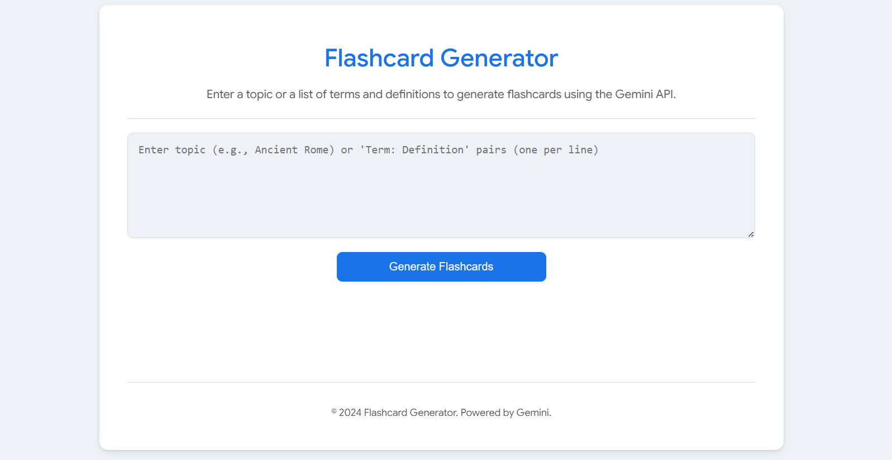
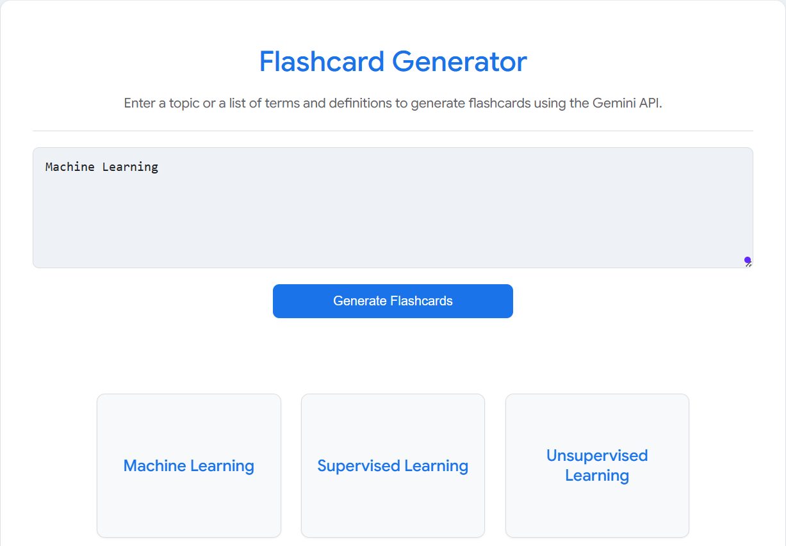
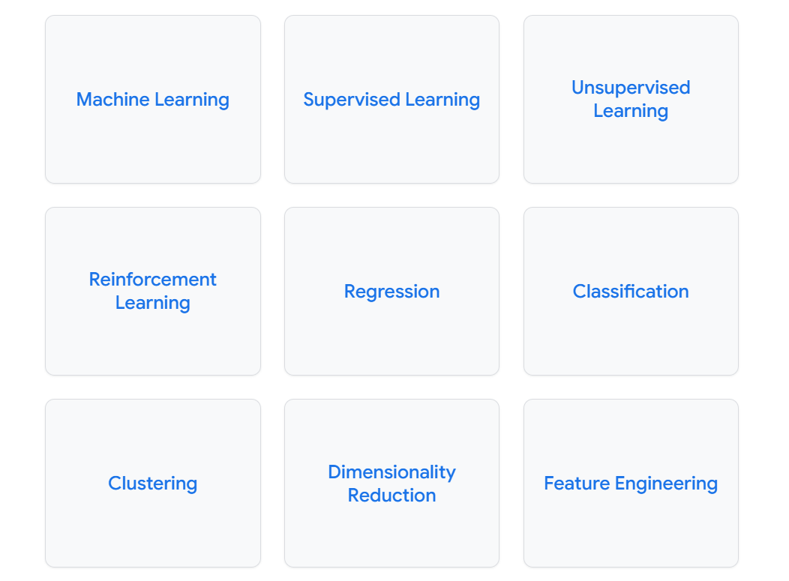
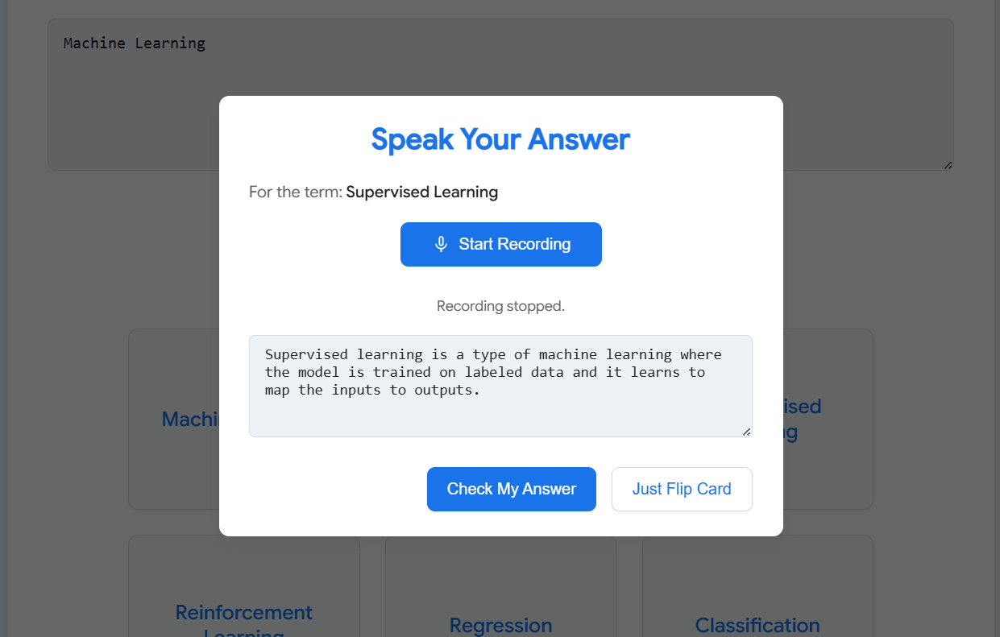
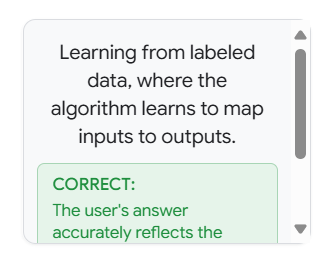

## Flashcard Generator with AI-Powered Voice Evaluation ⚡️🧠

This web application allows users to **generate interactive flashcards** on any topic using the power of the Google Gemini API. It's designed to be a modern study tool, enhancing learning through active recall and AI-driven feedback.

Users can input a topic (e.g., "Photosynthesis," "JavaScript Data Types") or provide a list of term-definition pairs, and the application will generate a set of flashcards.

**Key Features:**

*   **AI Flashcard Generation:** Leverages the Google Gemini API (`gemini-2.5-flash-preview-04-17`) to create flashcards from user input.
    
    
    
*   **Interactive UI:**
    *   Click to flip cards between term and definition.
    *   Responsive design for use on various devices.
    *   Light and Dark mode support for user preference.
*   **Voice Input for Answers:**
    *   Utilizes the browser's Web Speech API for users to speak their answers to flashcard terms.
    *   Visual feedback during recording.
    
*   **AI-Powered Answer Evaluation:**
    *   The Gemini API analyzes the user's spoken answer against the correct definition.
    *   Provides feedback: "correct," "partially_correct," or "incorrect," along with a brief explanation.
    
*   **Accessible Design:** Includes ARIA attributes for better accessibility.
*   **Modern Tech Stack:** Built with HTML, CSS, and TypeScript, using ES modules.

**How it Works:**

1.  **Input:** The user provides a topic or a list of terms and definitions.
2.  **Generation:** The app sends a prompt to the Gemini API, which returns a list of flashcards.
3.  **Display:** Flashcards are displayed interactively.
4.  **Interaction:**
    *   Clicking a card showing the term opens a modal.
    *   The user can choose to speak their answer or simply flip the card.
5.  **Voice Input & Evaluation (Optional):**
    *   If the user chooses to speak, their voice is transcribed.
    *   The transcribed answer, along with the term and correct definition, is sent to the Gemini API for evaluation.
    *   The AI's assessment and explanation are displayed on the flipped card.

**Tech Stack:**

*   **Frontend:** HTML, CSS, TypeScript
*   **AI:** Google Gemini API (`@google/genai` library)
*   **Speech:** Web Speech API (SpeechRecognition)

**Setup & Running Locally:**

1.  Clone the repository.
2.  Ensure you have a Google Generative AI API key.
3.  Create a `.env` file in the root directory (or use your operating system's method for setting environment variables) and add your API key:
    ```
    API_KEY=YOUR_GEMINI_API_KEY
    ```
    Replace `YOUR_GEMINI_API_KEY` with your actual key. The application expects this environment variable to be set.
4.  Serve `index.html` using a local web server (e.g., using the "Live Server" extension in VS Code, or by running `npx http-server` in the project directory).
5.  Open the application in your browser. Microphone permission will be requested for the voice input feature.

**Note on API Key:**
The `API_KEY` is loaded from `process.env.API_KEY`. **Do not commit your API key directly into the code or into a `.env` file that is tracked by Git.** Ensure your `.gitignore` file includes `.env` if you choose to use such a file locally.

** This application was developed with the assistance of Google AI Studio, iteratively translating instructive prompts into its features and functionality. **

# Run and deploy your AI Studio app

This contains everything you need to run your app locally.

## Run Locally

**Prerequisites:**  Node.js

1. Install dependencies:
   `npm install`
2. Set the `GEMINI_API_KEY` in [.env](.env) to your Gemini API key

3. Run the app: open the terminal and use the following command:
    `npm run dev`
